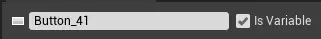
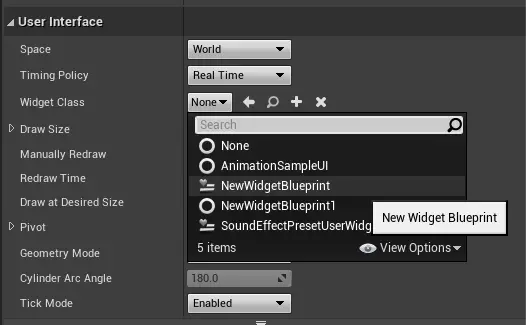

[TOC]

# UMG基本介绍

[【UE4】虚幻4UI系统简介 - 哔哩哔哩 (bilibili.com)](https://www.bilibili.com/read/cv13932938?from=search)

UMG（Unreal Motion Graphics UI Designer）是虚幻引擎中的一个可视化的UI设计工具，用户可以使用UMG来创建游戏中的UI元素。 

**Slate** 是完全自定义、与平台无关的用户界面框架,可以用Slate来编写UI,不仅是游戏UI,还能做编辑器的UI

# UMG设计界面

UMG编辑器中，控件设计器的界面如上图，我们来逐一介绍各个部分的主要作用。

## 1.菜单栏

此处的菜单栏和虚幻引擎中的其他界面的菜单栏作用相似，在此不做具体介绍。

## 2.工具栏

包含蓝图编辑器的一系列常用功能，比如编辑、保存、播放等。

## 3.编辑器模式选项

该UMG编辑器中共有两个模式——设计器模式和图标模式。两种模式分别对应两种不同的界面，在界面的右上角的区域3中就可以对编辑器的模式进行自由的切换。

## 4.可用控件表

用户可以在可用控件表里搜索并使用不同功能的控件（包括预制控件和自定义控件）。只需要从此处将想用的控件通过鼠标拖放到界面中部的视觉设计器中即可。

## 5.层级

在控件蓝图，每个控件都会有其父控件，整个控件蓝图是以一种树状的结构进行构建的。视觉设计器中的所有存在的控件都会显示在层级视图中，用户可以对这种层级关系进行直观的查看或编辑。

## 6.视觉设计器

这一区域会对控件的布局进行视觉呈现，用户可以使用鼠标拖动在该区域中操纵各种已经被添加到蓝图里的控件。

## 7.详情

与其他界面的详情窗口类似，用于显示当前所选控件的属性。

## 8.动画

这个区域包含UMG的时间轴动画轨，可以用于设置控件的关键帧动画。

# 核心：控件

UMG的核心是控件。虚幻引擎中预制了许多可用的控件，如按钮（Button）、复选框（Check Box）、进度条（Progress Bar）、文本块（Text Block）以及各种容器控件。用户也可以通过编写控件蓝图来创建自定义控件。这些控件可以在蓝图和C++代码中进行实例化并添加到玩家的视图上，组成游戏画面上的HUD；也可以被实例化到场景中，成为场景中的可互动元素。 

## 1.控件层级

在前面介绍UMG设计界面时我们提到了“层级”这一概念。在UMG中，绝大部分控件都可以拥有一个或多个子控件（取决于控件的类型）。例如：按钮可以拥有一个子控件（通常是一个文本块或者一张图片，当然也可以是其他各种控件），画布面板可以拥有多个控件（这是一个用于设计布局的控件，之后会详细介绍），而进度条则不能拥有任何子控件。 

如上图所示，能拥有的子控件数目通常都会在控件的描述文本中标明，将鼠标悬浮于控件列表的控件上时就能看到。

通过设置子控件的嵌套，我们就获得了一个分层的控件结构。这个结构即方便我们对控件进行管理，也为我们在设计界面时提供更加自然的思考方式。

## 2.逻辑实现

首先在详情区域的最顶部我们能看到如图的一个文本框和一个复选框。其中的文本框用于设置控件的名称，而复选框则用于确定控件是否作为变量显示在蓝图中。只有勾选了该复选框，控件才在蓝图中直接可见（可直接被获取或设置）。

每一个控件都有其不同的属性，如文本块会有Text属性用于设置其要显示的文本，进度条会有Percent属性用于设置其当前的进度百分比，复选框会有Checked State属性用于描述其当前被选中的情况……这些属性可以在UMG设计器中进行设置，也可以在蓝图中进行设置，通过这些属性，设计者就可以让界面有不同的状态和效果。

每个控件也有其用于处理相应逻辑的事件

## 3.布局设计

布局，也就是对控件相对位置、相对尺寸的自动计算和更新。UMG提供了一系列的容器面板控件（Panel）用于满足设计者各种可能的布局需求。

- 定义复杂相对位置的画布面板（Canvas Panel）
- 实现排列布局的Horizon Box和Vertical Box 
- 用于实现分页显示的Widget Switcher

每一种容器控件都有专用于设计布局的属性，同时也会为其子控件添加相应的插槽（Slot）属性，通过这些属性，设计者就可以摆脱代码，轻松地实现各种基本布局效果。

## 控件概念介绍（按钮为例）

作为最基础的控件之一，我们就使用按钮来更细致地介绍一下控件中各种属性和事件的基本用法。

## 按钮

按钮的各类基本属性（忽略掉插槽属性栏），从上至下分别是：

- 用于设置按钮外观的Appearance属性栏
- 设置按钮交互效果的Interaction属性栏
- 设置各类可访问性的Accessibility属性栏
- 设置一些通用行为的Behavior属性栏
- 设置渲染转换属性的Render Transform属性栏
- 调整按钮性能表现的Performance属性栏
- 设置裁剪方式的Clipping属性栏
- 设置界面导航方向的Navigation属性栏
- 设置控件本地化属性的Localization属性栏
- 以及包含各种事件的Events栏。

### 1.外观（Appearance）

Style属性包含对各种状态下的按钮样式的设置，主要分为了通常（Normal）、光标覆盖（Hovered）、被按下（Pressed）、禁用（Disabled）四种状态。

Tint属性用于设置在原图片基础上混合的颜色，可以理解为在原图片上增加了一层颜色滤镜，设置之后的基本效果如下图所示

Draw As属性用于设置图片的使用方式，其有四个选项：
- None选项意思是不绘制图片；
- Box选项会将原图片切分成九宫格，其中各个块都会根据下面的Margin属性进行相应的拉伸；
- Border选项与Box选项相类似，但不同的是九宫格中的中心位置会被掏空，只留下外边的八个格子根据Margin属性进行拉伸；
- Image选项则是使用原始图片，在选择该选项之后，还会出现一个新的Tiling属性，在其中可以选择图片不同的填充方式。

### 2.交互（Interaction） 

Interaction属性栏是所有控件都有的栏目，只是其中的某些具体属性可能有所不同。

首先是Is Focusable属性，这是所有控件都有的属性之一。它用于设置控件是否可以由键盘进行操作，例如在选中按钮后按下回车键激活按钮按下事件，或文本输入框中接收键盘输入。只有在勾选该属性后，控件才可以响应键盘操作。

再往下可以看到针对于按钮的三个属性，它们是用来设置按钮的点击（鼠标）、触摸（手指）、按下的具体方式的。

其中Click Method有四个选项，从上往下分别对应于：

- 必须在按钮范围内完成按下并松开鼠标按键的操作才算点击成功

- 只要鼠标按键在按钮上被按下就算一次点击

- 只要鼠标按键在按钮上被松开就算一次点击

- 必须在按钮上的同一位置按下并松开鼠标按键的操作才算点击成功

### 3.可访问性（Accessibility） 

这里先不进行介绍。

### 4.行为（Behavior）

在这一栏中，用户可以对按钮的一些特殊行为进行设置。 

- 提示文本（Tool Tip Text）。

  提示文本指的是我们鼠标悬浮在该控件上时显示的一个顶部的文本内容，一般用于对控件的作用进行描述

- Is Enabled属性

  对于按钮来说，在勾选之后，按钮才可以正常地被玩家按下，在取消勾选之后，按钮则会变成Disabled样式，对于玩家的操作都不会做出响应。

- 接着是Visibility属性 

  - Visible表示控件可视，同时也会参与命中测试
  - Collapsed表示控件将被折叠，此时控件不可视且不占据容器控件的空间，该状态下控件自然不会参与命中测试
  - Hidden表示控件不可视，但仍会占据容器控件的空间，不会参与命中测试
  - Not Hit-Testable（Self&All Children）表示控件可视，但它本身和它的所有子控件都不会参与命中测试
  - Not Hit-Testable（Self Only）表示控件可视，它本身不会参与命中测试但它的子控件会

**命中测试（Hit-Test）的概念**。简单来说就是，在玩家进行点击或触摸时，游戏会进行命中测试，只有参与命中测试的控件才会对点击和触摸做出响应。

- Tool Tip Widget属性，通过对这个属性进行设置，用户可以使用指定的控件来作为控件的提示。在希望实现更丰富的提示信息时，可以使用此属性来指定提示控件。 

- 最后是Cursor。在勾选这一属性后，可以在右侧选择鼠标悬浮在该控件上时显示的样式 

### 5.渲染变换（Render Transform）

可以在不改变控件真实坐标、尺寸的前提下，对控件显示在屏幕上的位置、样式、大小进行设置 。

### 6.性能（Performance）

该属性栏下只有一个属性——是否易变（Is Volatile）。当控件经常发生改变时，勾选此选项告诉引擎“不需要对该控件的信息进行缓存，因为它的信息总是会变化”，这可以提高游戏的性能表现；但如果控件不经常发生改变，则不应该勾选此选项。

### 7.裁剪（Clipping）

该属性栏是所有控件都拥有的，用户可以通过它来设置控件的裁剪行为，即告诉系统如何对使用边界框将控件的图形或文本限制在某个区域。大致可以实现的效果如下。

### 8.导航（Navigation）

在这一栏中，用户可以对使用游戏手柄时的下一个选中的控件进行设置。Left、Right、Up、Down、Next、Previous分别对应游戏手柄上的左、右、上、下、下一个、上一个按键。

### 9.本地化（Localization） 

这一栏中只有一个属性。 通过这个属性可以为当前控件设置文字、图像的排列方向，一共有四个选项，分别表示：

- 继承父控件的设置

- 根据当前文化（Culture）进行设置

- 从左到右

- 从右到左

### 10.事件（Events）

在该栏中列有按钮所定义的所有事件，用户可以根据具体需要实现的逻辑在蓝图中对特定的事件进行处理。

## 画布面板（Canvas Panel）

画布面板是我们在新建一个控件蓝图时的默认根控件，也是我们在做自适应控件时常用的容器控件，我们就以画布面板为例介绍一下容器控件和控件布局中的一些基本概念。在画布面板的插槽中，一共有五大属性：

- 锚（Anchor）
- 坐标大小
- 校准点（Alignment）
- 自适应内容大小
- 渲染次序（ZOrder）

### 1.锚（Anchor）

锚是控件在画布面板中进行自适应布局的核心属性。

在游戏采用不同的画面比例时 ，我们会希望某些控件能够随着画面比例的变化调整自己的位置以占据自己所期望的某一区域（如让血条保持在画面的左上角）），我们就需要用到锚点。我们希望控件能保持一定的画面占比（如让人物属性界面保持让玩家看着舒服的缩放比例），我们也需要用到锚点。 

锚点是由四个量定义的，分别为MinX、MinY、MaxX和MaxY，这四个量分别对应着锚点的左边、上边、右边和下边在画面中的位置（取值范围均是0~1，意思是其在画布控件中的相对位置，与校准点中X、Y的定义方式相似）

### 2.坐标与大小（Position and Size）

坐标大小很容易理解，就是字面意思的控件坐标和控件大小。配合锚点使用时，其意义是设定初始的坐标和大小。

### 3.对其/校准（Alignment） 

对齐/校准是对控件自身原点的定义，其两个值X和Y的取值范围均为0~1。它以控件自身的左上角作为零点，向右为X正方向，向下为Y正方向定义了一个控件自身的坐标系，每移动1，控件移动一个自身大小的距离。

移动校准值，控件的原始位置坐标不会变，也就是说只要设置为（0，0） ，控件即可归位。

用鼠标拖动控件，是修改其原点位置；

### 4.自适应大小（Size To Content） 

Size To Content属性在勾选了之后控件的大小就会根据其子控件的desired size来决定，若不勾选则不受子控件的desired size影响。下面展示了一个文本块作为按钮的子控件时，按钮的Size To Content对其外观的影响，图一为没有勾选Size To Content属性的情况，图二为勾选了Size To Content属性的情况。该属性的作用还是很清晰的。

### 5.渲染次序（ZOrder）

最后是ZOrder属性。对ZOrder属性进行修改，将会改变控件的渲染次序，也就是决定谁更靠前谁更靠后。ZOrder越大，控件就会越靠前，反之则越靠后。

# 控件使用方法 

## 使用控件作为HUD界面

创建 控件蓝图 并设计好布局之后，若要令其显示在游戏内，需要在另一个蓝图中（例如 关卡蓝图 或 角色蓝图）使用 **Create Widget** 和 **Add to Viewport** 节点调用它。

## 设置输入模式 

很多时候我们会需要让玩家和界面进行交互，这就需要我们对玩家的输入模式进行相应的设置，例如显示/隐藏光标、启用/禁用光标与界面的交互。

要改变光标和界面的交互方式，我们可能用到下面三个节点：

- Set Input Mode Game and UI节点用于将光标设置成可以在操纵游戏的同时又可以与UI进行交互，其中还有几个参数设置默认聚焦的控件以及光标的锁定模式。
- Set Input Mode Game Only节点用于将光标设置成只能操纵游戏，而不与UI发生交互。
- Set Input Mode UI Only节点用于将光标设置成只与UI进行交互而不会操纵游戏，其参数与第一个节点作用类似。

## 动态添加子控件 

这些子控件除了可以在UMG编辑器中设置，还可以通过蓝图来动态添加。只需要将子控件实例化，然后调用Add Child节点将其添加到制定控件上即可。

## 创建3D控件 

想要将控件制作成3D控件摆放在游戏场景中，我们需要将控件蓝图设计为没有画布面板的控件。

新建一个Actor蓝图，在蓝图中添加Widget组件。

然后在该组件的详情中，找到User Interface栏，将其下的Widget Class选项设置为你想要制作成3D控件的控件蓝图。然后根据需求设置好其他参数。

这样子一个3D控件就创建好了，在编译、保存之后，将该Actor蓝图直接拖放到场景中即可。

要实现玩家与场景中3D控件的交互，我们需要为角色蓝图添加Widget Interaction组件。

此组件会向正前方发射一条射线用于充当角色和3D控件交互中的“光标”，通过在蓝图中调用Widget Interaction组件的相应函数，就可以实现和普通控件中一样的各种交互效果。如下图中Press Pointer Key节点就是用于模拟在UI中按下某一按键的事件，Release Pointer Key节点则用于模拟松开按键的事件。 

